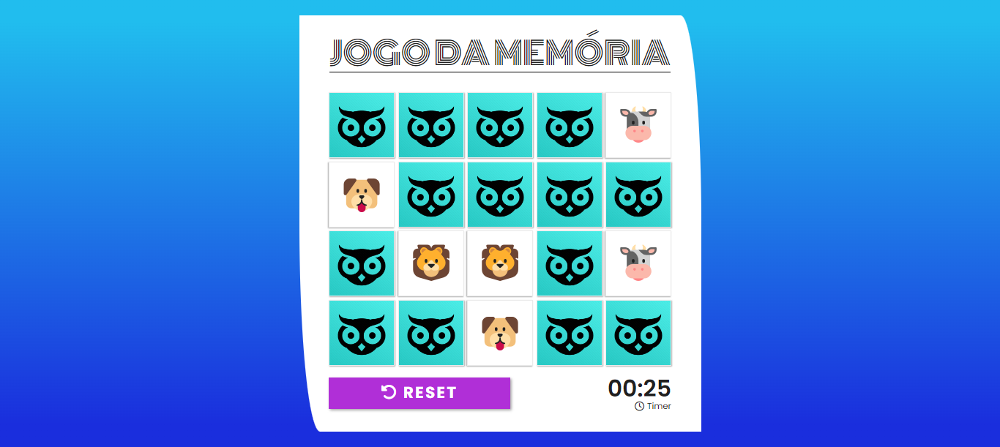

# 🦉 EMOJIMÓRIA

Minigame baseado no jogo da memória desenvolvido no bootcamp da Dio. Possui algumas alterações de layout, mais itens e um contador de tempo.

## Como jogar?

Clique na carta que você deseja virar, ao descobrir todos os pares você vence a partida.

## Sobre o projeto...

O projeto foi desenvolvido em Javascript com HTML e CSS, é um minigame de web browser e possui apenas interface para desktop.

## Imagem do projeto

